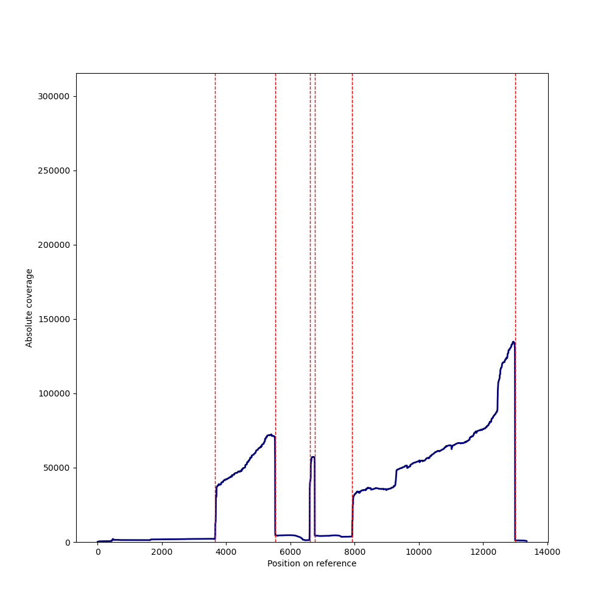
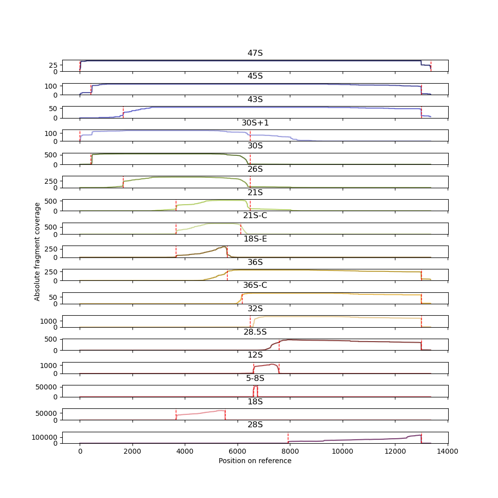
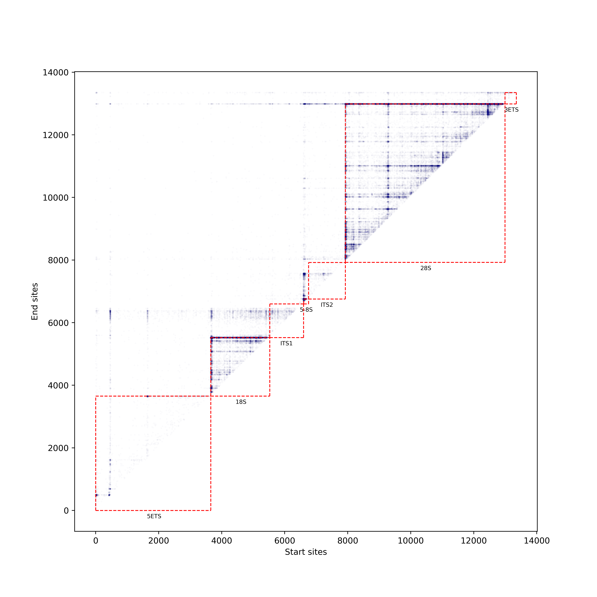
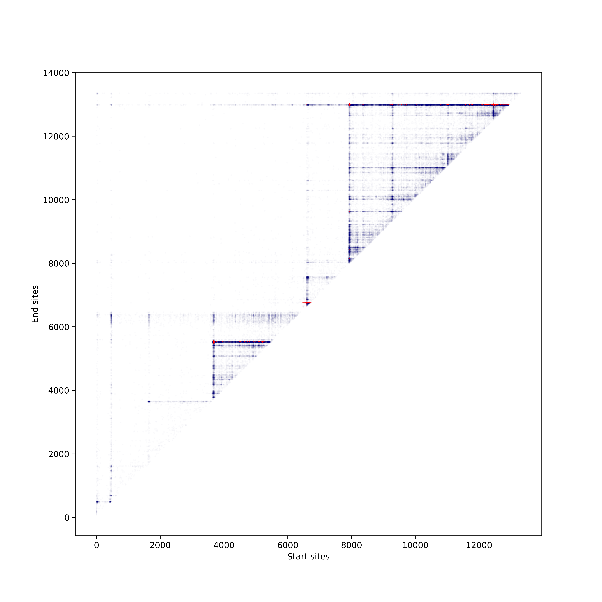
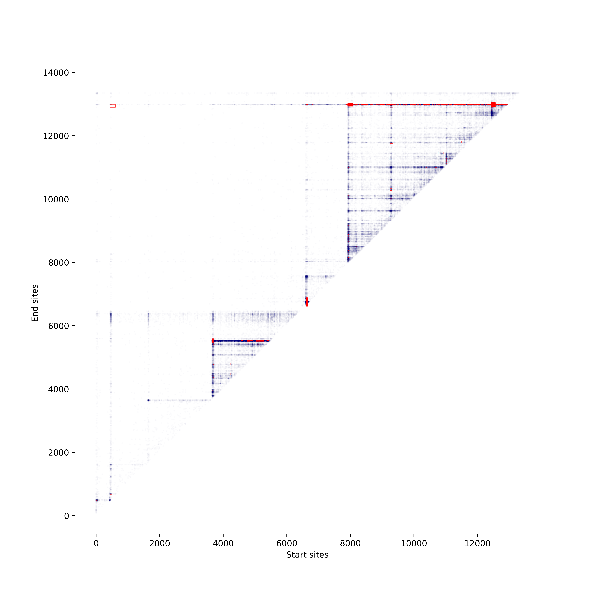
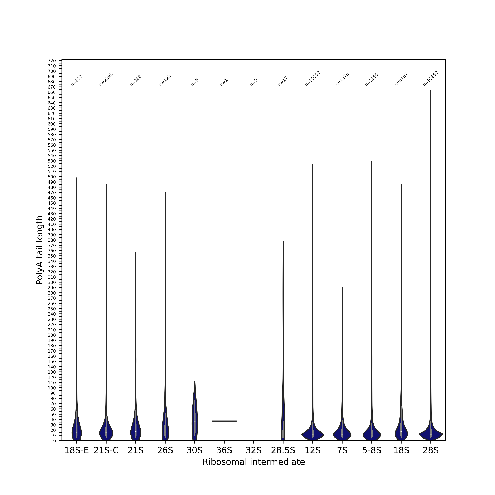
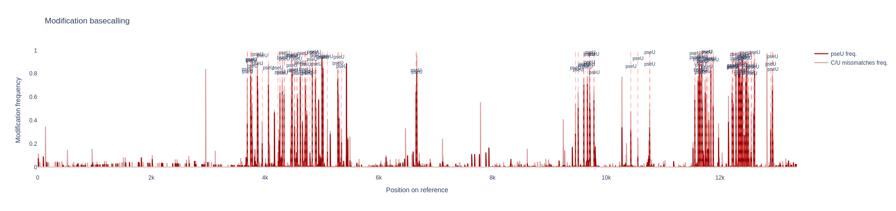

# NanoRibolyzer

[](CODE_OF_CONDUCT.md)   

## Abstract
NanoRibolyzer is an Epi2Me compatible tool to analyse ribosomal RNA biogenesis pathway at single nucleotide resolution. 
Nanoribolyzer aligns reads to the human RNA45SN1 of hg38. A template based read association approach allows for quantification of known ribosomal intermediates.
Several template free clustering approaches can are integrated to detect and study unknown ribosomal RNA intermediates. 
In addition to the template association NanoRibolyzer performs polyA tail estimation, finds abundant cut sites, extracts 5' terminal base sequences for motif analysis 
and detects the relativa abundance of specific RNA modifications. Outputs of NanoRibolyzer can be used to disect specific subpopulations of ribosomal RNA reads and asses characteristic properties   
on a single nucleotide resolution level. 

## Userguide
To use NanoRibolyzer [Epi2Me](https://labs.epi2me.io/downloads/),[Nextflow](https://www.nextflow.io/docs/latest/install.html) and [Docker](https://docs.docker.com/engine/install/) must be installed.

To download NanoRibolyzer open Epi2Me and navigate to Launch and press the button Import Workflow. A pop-up window will appear in which you should copy the following link: "https://github.com/stegiopast/wf-nanoribolyzer"
Press download and the Workflow should be integrated in Epi2Me. On Windows we recommend to install [WSL2](https://learn.microsoft.com/en-us/windows/wsl/install) and subsequently install Epi2Me, Nextflow and Docker within the command line.
Also make sure to install the [nvidia-container-toolkit](https://docs.nvidia.com/datacenter/cloud-native/container-toolkit/latest/install-guide.html) on WSL.

## Methods


The analysis workflow of NanoRibolyzer starts with the pod5 output format of ONT’s MinKnow. Reads are basecalled using dorado basecaller (cite). All sequenced reads are basecalled and trimmed with Porechop (cite). The trimmed reads become aligned with the map-ont flag of minimap2 (cite) to the 45SN1 reference of hg38 (cite). The ids of 45SN1 aligning reads are used to filter the original pod5 file. The filtered pod5 file is rebasecalled using the integrated models for modification detection and polyA taillength of dorado. The read ids in the resulting unaligned bam file is used to collect metainformation about reads on a single nucleotide resolution. 
Rebasecalled reads become aligned to the 45SN1 reference. Resulting bam files are used to perform several clustering algorithms. The pipeline includes a reference-based and two reference-free clustering approaches.  

# Template based fragment association


The reference-based algorithm performs an association of sequenced reads to literature based ribosomal intermediates. In this approach the minimal overlap pairs between a query read and all possible intermediates becomes determined. The minimal overlap is determined by defining the minimal relative overlap of query over intermediate and intermediate over query. After defining the minimal overlap for each possible query-intermediate pair, the argument of the maximal overlap-pair is used for the intermediate association. Read clusters are stored in tsv format including the read ids, the absolute and relative amount and the start and end sites of all reads in a cluster. Non clustered reads are stored in a separate file. Moreover, bed files with the read clusters are stored to enable visualization on the integrate genome viewer (igv). The 45SN1 reference fasta in the ribolyzer references repository must be used for visualization. 


# Template free fragment association


The reference-free algorithms are based on a preceding intensity matrix construction. Read ids become embedded in a 45SN1 length x 45SN1 length matrix by using their start and end points of the alignment as coordinates. The intensity of a coordinate in the matrix is determined by the number of reads aligning to it. 

1. In the first clustering approach all reads sharing a start and end site are interpreted as a read cluster. The approach is most performant with reads not underlying degradation processes. 
2. The second approach is using a hierarchical density-based clustering approach with alternating neighbourhood ([HDBSCAN]("https://scikit-learn.org/1.5/modules/generated/sklearn.cluster.HDBSCAN.html") to cluster reads sharing similar start and end sites in the intensity matrix. HDBSCAN determines clusters of high intensity read groups having several neighbouring read groups in the intensity matrix. Coordinates on the intensity matrix with a high intensity lacking neighbours are defined as independent clusters. Resulting clusters of the HDBSCAN approach can be summarized by either constructing a consensus sequence of reads belonging to a cluster (higher demand) or by extracting a reference sequence from the 45SN1 of hg38 by using the minimal start point and the maximal end point of the cluster. (lower demand)  

# Poly-A estimation
NanoRibolyzer is determining the polyA lengths with the integrated polyA length estimation tool of dorado. Due to the experimental design of the Oxford Nanopore Technologies related sequencing library, polyA tails can only be captured in the entire length when performing directRNA sequencing approaches, since these protocols exclusively include a ligation of oligo_dT primers at the 3'end of RNA fragments. NanoRibolyzer performs polyA estimation on cDNA as well, but it is crucial to consider the oligo_dT primers aligning on any sterical possible position of polyA tail. 

# Modification detection
Modification detection is performed with the integrated modification detection models of dorado. Modifications can only be detected when performing directRNA sequencing approaches, since reverse transcription and strand switching to obtain cDNA erases the chemical signature of RNA modifications.    

# Cut-site determination


A determination of significant abundant start and end sites is computed using the start and end site information of bam files. Start and end sites with absolute abundance are determined over the 45SN1 reference. For each reference-based intermediate cut site interval, the mean and standard-deviation (stdd) of start and end sites become determined respectively. Cut sites occurring at least mean + (2*stdd) times are considered as significant abundant cut-sites. For overlapping reference-based intermediate cut site intervals, metrics are determined by the mean of means and the mean of stdds. Output files are stored in tsv and bed-file format including information about their relative abundance and the cut site location. The bed files can be visualized using igv.  

# Extraction of 20 nucleotides before polyA tail


NanoRibolyzer performs an extraction of the last 20 nucleotides before a polyA tail. Each read is respectively investigated. Starting from the 3’ end of a trimmed read the polyA tail starting position is determined by finding the first triple adenine (AAA) pattern on the read. Starting from the determined point the algorithm iterates over the nucleotides towards the 5’end until less or equal 50% of the nucleotides are adenines (A). From that point the algorithm iterates towards the 3’end again, until the observed position of the iteration is an adenine and more or equal 90% of the nucleotides are adenines to define the end point of the polyA tail. The last 20 nucleotides from 5’ to 3’ end of the determined end point are extracted and stored in three ways. First the end sites are sorted in a txt format file including only the 20-nucleotide sequence, which can be used as direct input for motif [enrichment analysis tools](https://meme-suite.org/meme/tools/streme). Secondly, the reads are stored with their read ids and the 20-nucleotide sequence in fasta format. Thirdly, the reads are stored with their read ids, the 20-nucleotide sequence and the 20-nucleotide sequence + trashed 3’end sequence for extraction assessment in a second fasta file.

## Outputs

NanoRibolyzer provides files, tables and graphics in different subfolders. Here we describe all the outputs in detail to enable users the performance of downstream analysis. 
All the outputs will be provided in the default workfolder of Epi2Me.

```bash
├── basecalling_output      # Data for basecalling, trimming and first alignment to 45SN1 of hg38
│   │
│   ├── basecalled_not_trimmed.bam              # Unaligned basecalling output of dorado untrimmed
│   ├── basecalled_not_trimmed.fastq.gz         # Converted fastq file of basecalling output untrimmed 
│   ├── basecalled.fastq.gz                     # Converted fastq file of basecalling output trimmed with porechop
│   ├── filtered.bam                            # Alignment of basecalled.fastq.gz to 45SN1 of hg38 
│   ├── filtered.bam.bai                        # Index for above
│   ├── filtered.fastq.gz                       # Converted fastq file of filtered.bam 
│   └── sequencing_summary.txt                  # Summary fuile of dorado basecalling
│
├── converted_to_pod5                           # If original seqeuncing files were written in fast5 format they become converted into pod5 first and will be stored in this directory
│   │
│   └── converted.pod5                          # File is written only if original sequencing file was in fast5 format
│
├── filtered_pod5
│   │
│   ├── filtered.pod5                           # Pod5 file with files aligning to 45SN1 of hg38
│   ├── filtered_pod5_basecalled.bam            # 45SN1 aligned basecalling output of dorado from filtered.pod5 untrimmed. This file includes move table (all) and modification tags (directRNA). 
│   ├── filtered_pod5_basecalled.bam.bai        # Index for above
│   └── sorted_filtered_reads.txt               # List with read_ids aligning 45SN1 of hg38
│
├── intensity_matrix                            # Folder contains
│   │
│   ├── intensity_matrix.csv                    # Table with read ids and number of reads aligning to (start site, end site) pairs  
│   ├── intensity_matrix.html                   # Interactive html file with 50000 most abundant (start site, end site) pairs
│   └── intensity_matrix.png                    # An image of the intensity matrix used for the clustering approach
│
├── template_based_analysis
│   │
│   ├── template_alignment_df.csv               # List of single aligned reads with aligned sequences reconstructed by cigarstrings, includes start and end sites on the reference. The percentage of overlap with associated fragment is listed. 
│   ├── template_fragment_df.csv                # List with read_ids being associated to fragments from literature. Table stores the extracted sequence of the literature fragment and the start and end site on 45SN1.  
│   ├── cutting_sites_general.csv               # Cut sites occuring in significatn abundance in relation to the mean abundance fo reads on 45SN1
│   ├── cutting_sites_fragment_based.csv        # Cut sites occuring significant abundance in relation to mean abundance of the literature fragments they are associated to. Threshholds for overlapping fragments were determined by the mean of means. 
│   ├── start_sites_general.bed                 # Bed file for visualization of general start sites in IGV
│   ├── end_sites_general.bed                   # Bed file for visualization of general end sites in IGV
│   ├── start_sites_fragment_based.bed          # Bed file for visualization of fragment based start sites in IGV
│   ├── end_sites_fragment_based.bed            # Bed file for visualization of fragment based end sites in IGV
│   ├── template_driven.bed                     # Bed file visualizing fragment abundance in igv
│   ├── most_abundant_template_driven.bed       # Bed file visualizing fragment abundance in igv. Only fragments carrying more than mean * 2.stdd reads.
│   └── template_driven_analysis.bed            # Log file of template_based_analysis script
│
├── fragment_hdbscan_analysis                   # Outputs of template free clustering approaches. Same structure is given for fragment_intensity_analysis.
│   │
│   ├── alignment_df.csv                        # List of aligned reads with aligned sequences reconstructed by cigarstrings, includes start and end sites on the reference
│   ├── fragment_df.csv                         # For each fragment being determined by template free association a consensus sequence, proportional sequence, read ids, absolute and relative number of reads are provided
│   ├── fragment_df_simple.csv                  # A simpler form of the table above
│   ├── unclustered_reads_df.csv                # Stores all reads, which could not be clustered in a read group. The table has an equal format as alignment_df.csv  
│   ├── no_template.bed                         # Representation of all fragments found with template free clustering approaches.    
│   ├── most_abundant_no_template.bed           # Fragments found with template free clustering approaches carrying more than mean * 2stdd of the reads  
│   ├── top_150_no_template.bed                 # Top 150 Fragments found with template free clustering carrying most of the reads
│   ├── intensity_matrix.png                    # Intensity matrix used for the clustering approach with 300 clusters carrying the most reads. Clusters are shown as red rectangles of which the upper left corner represents common (start,end) sites. 
│   └── fragment_analysis.log                   # Log file of fragment_hdbscan_analysis script
│
├── readtail_analysis                           # Extract the last 20 nucleotides in every reads before the polyA tail. Output of this folder can be used for motif enrichment analysis
│   │
│   ├── X.txt                                   # List of 20 nucleotide long sequences of readtails before polyA tail for all reads associated with literature fragment (X).  
│   ├── X.fasta                                 # Fasta of 20 nucleotide long sequences of readtails before polyA tail for all reads associated with literature fragment (X). Header indicates the read id.
│   ├── X_tail_comparison.fasta                 # Fasta of 20 nucleotide long sequences of readtails before polyA tail for all reads associated with literature fragment (X). Header indicates the read id. Additionally shows the excluded polyA tail.
│   └── X.json                                  # Dictionairy with modet abundant nucleotides for each position of the last 20 nucleotides before polyA tail for all reads associated with literature fragment (X).
│
├── taillength_estimation                       # Output folder of polyA taillength assessment
│   │
│   ├── tail_estimation.csv                     # Lists taillength for each read_id aligned to 45SN1
│
├── polyA_template_based                        # Assesment of polyA taillengths for reads associated to specific literature based fragments
│   │                  
│   ├── polyA_tails_intermediates_mean.html     # PolyA taillength of reads associated with literature based fragments. Start and end sites of shown fragments are determined by mean start and end sites of reads associated to a fragment. 
│   ├── polyA_tails_intermediates_min_max.html  # PolyA taillength of reads associated with literature based fragments. Start and end sites of shown fragments are determined by minimal start and maximal end site of reads associated to a fragment.      
│   ├── polyA_tails_intermediates_template.html # PolyA taillength of reads associated with literature based fragments. Start and end sites fit to the start and end sites of literature based fragments.
│   ├── taillength_per_intermediate_mean.csv    # Table storing the information for the html objects above
│   ├── taillength_per_intermediate_min_max.csv # Table storing the information for the html objects above
│   └── violinplot_taillength_per_intermediate.png   # Figure showing the polyA taillength for all reads associated to specific literature based fragments 
│
├── polyA_hdbscan_based_clusters                # Assesment of polyA taillengths for reads associated to specific fragments resulting from hdbscan. Same folder structure for polyA_intensity_base_clusters
│   │                   
│   ├── polyA_tails_clustering.html             # PolyA taillength of reads associated with reference free fragments. The 300 most abundant fragments are shown.  
│   ├── polyA_tails_intermediates_min_max.html  # PolyA taillength of reads associated with literature based fragments. Start and end sites of shown fragments are determined by minimal start and maximal end site of reads associated to a fragment.      
│   └── polyA_tails_intermediates_template.html # PolyA taillength of reads associated with literature based fragments. Start and end sites fit to the start and end sites of literature based fragments.
│
├── coverage_plots                              # Plots showing the read coverage of reference based templated after association
│   │
│   ├── coverage_fragments_absolute.png         # Coverage plot for each reference based fragment after read associtaion. Normalize to the maximum expression of a respective fragment.
│   ├── coverage_fragments_absolute_all.png     # Coverage plot for each reference based fragment after read associtaion. Normalize to the number of all reads in the sample. 
│   ├── coverage_fragments_relative.png         # Coverage plot for each reference based fragment after read associtaion. Normalization to the maximum expression of a respective fragment and shown as percentage.
│   ├── coverage_total_sample_absolute.png      # Read coverage of the whole 45SN1 normalized to number of all reads in the sample.
│   └── coverage_total_sample_relative.png      # Read coverage of the whole 45SN1 normalized to number of all reads in the sample and shown as percentage.
│
├── cut_site_plot                               # Visualization for significantly abundant cut sites
│   │
│   └── cut_sites.html                          # Cut sites determined by fragment based threshold cut site determination of template based analysis. Normalized to the number of all reads in the sample.
│
└── rRNA_report.html                            # HTML report including all plots decribed above. Will be automatically integrated in Epi2Me.
```

NanoRibolyzer provides a variety of default output plots, which will be presented in the subsequent section. However, it also allows for downstream data analysis, linking different properties of reads like polyA taillength, modification ratios and  cluster size via read id. In the following we are showing a collection of plots that are directly accessible when using NanoRibolyzer. For a whole collection of accesible plots, please open this [html](./figures/rRNA_report.html) file.  

# Coverage Plots
NanoRibolyzer aligns reads to the 45SN1 template of hg38. It shows the overall coverage of the whole reference. 


The read coverage of different literature based fragments during ribosomal biogenesis is shown, which allows the assesment of the read association performance. 



# Intensity Matrix and clustering

Aligned reads become collected in an 2 dimensional intensity matrix, which is constructed by (start site, end site) pairs. The intensity of a coordiante in the matrix is determined by the min max normalized read abundance. The contrast of the normalized values is leveraged by an addition of 1% to each datapoint > 0. The absolute abundance of reads can be found in the instensity_matrix output folder. 



Template free clustering approaches are performed using the creates matrix as input. 
An intensity based approach extracts (start site, end site) datapoints with maximal abundance.  
The upper left corner of the red boxes determine the (start site,end site) pair of determined clusters. 


A density based approach [HDBSCAN](https://scikit-learn.org/1.5/modules/generated/sklearn.cluster.HDBSCAN.html) uses the information of neighbourhood to find template free read clusters. 
The upper left corner of the red boxes determine the (start site,end site) pair of determined clusters. 



# PolyA taillength prediction

For each reference based template the distribution of polyA taillengths is shown as a violinplot. For the template free clusters with the highest abundance the violinplot is provided in a similar manner. 


# Modification ratio
NanRibolyzer uses dorado based models to asses modification frequencies on the 45SN1 template of hg38.



# Interactive plots
For many plots shown here an interactive html based figure will be provided by the output of NanoRibolyzer. Please download the example [html](./figures/rRNA_report.html) file and open it in a browser of your choice. The presented output is integrated in Epi2Me and will be directly accessible on the plattform. 

## Software
All basecalling processes are using the latest dorado docker environment ("ontresearch/dorado:latest") of ONT (Oxford Nanopore Technologies). 
For the publication of our data we used the newest models provided with dorado version 0.7.2 in May 2024.

If you want to use our specific dorado version you can pull a specific docker environment from [docker hub](https://hub.docker.com/r/ontresearch/dorado/tags). 
("ontresearch/dorado:sha58b978562389bd0f1842601fb83cdf1eb2920218") 

Please be aware that you need to specify this version in the nextflow.config file by replacing ontresearch/dorado:latest at line 68. (container = "ontresearch/dorado") 
You can do so for all versions of dorado, by finding the right tag at [docker hub](https://hub.docker.com/r/ontresearch/dorado/tags).
All other processes use a docker environment we built for this project. Teh versions of the environment can be found in the docker_images/other_tools folder of this repository. 

## References

## Funding

